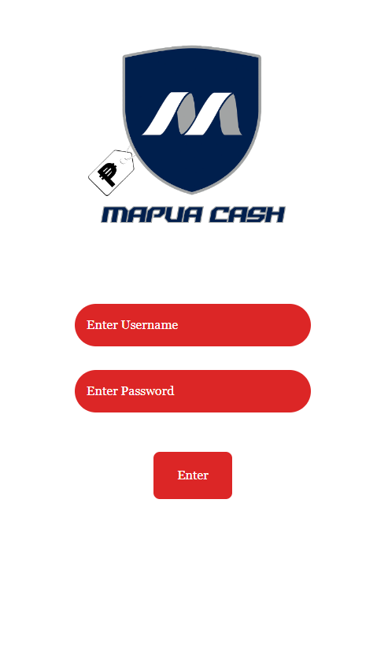
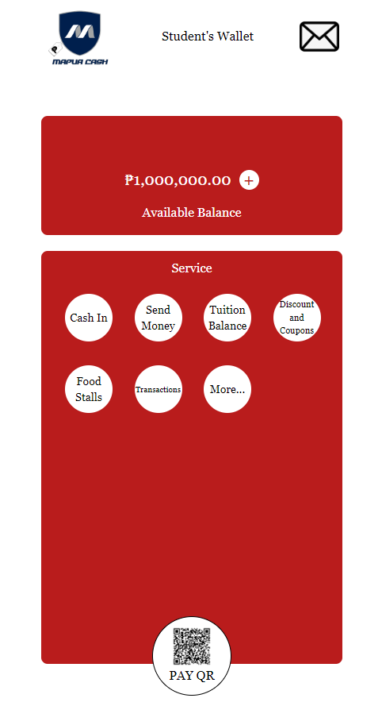
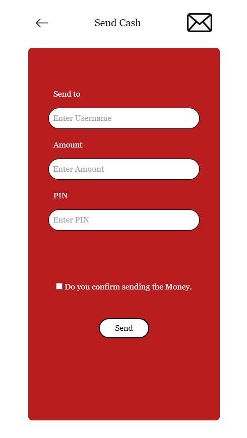
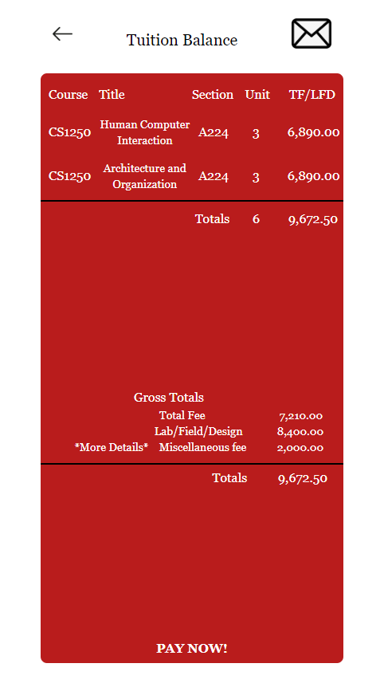
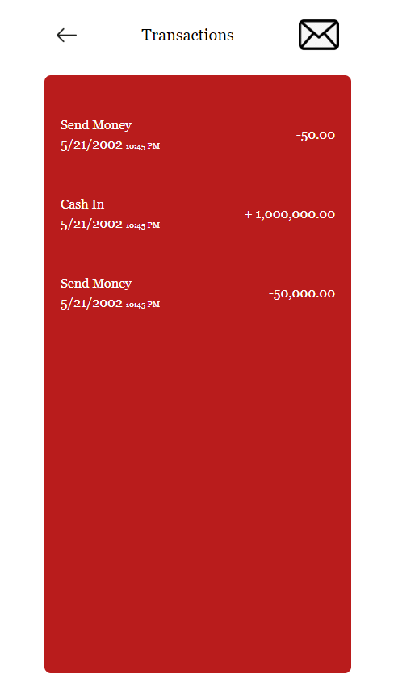

<h1 align="center"> Introduction </h1>
 

    MapuaCash stands out as an intuitive financial management tool catered specifically to
    Mapúa University students across all campuses. Its standout feature lies in its seamless 
    integration with the university's billing systems, allowing for effortless handling of 
    semestral payments, club dues, and event fees directly through the app. By centralizing 
    financial transactions, MapuaCash simplifies processes for students and university staff, 
    reducing administrative burdens. Additionally, MapuaCash provides an array of features that let students track their 
    spending, create budgets, and learn more about their spending patterns. With tools like 
    real-time spending updates and expenses categorization, students can keep on top of their 
    budget and make wise financial decisions within the campus. The software also offers 
    thorough financial reports, which helps students examine their spending habits and 
    develop money management skills. MapuaCash's intuitive interface and extensive 
    functionalities enable students to confidently manage their school finances and achieve 
    academic and personal success while attending Mapúa University.
  

 
<h1 align="center"> User-Interface and Instructions </h1>

<h3 align="center"> Log In</h3>

  

 

   This is the opening page of the
   application. Users are required
   to input their Mapua-provided
   credentials to have access to
   the MapuaCash application.
 

<h3 align="center"> Home Page</h3>

  

 

   The home page is where the
   user will see all the available
   features of the MapuaCash
   application. At the bottom
   center there is also the option
   of a Payment through QR scan
   for easier transaction.
 

<h3 align="center"> Cash In Page</h3>

  

 

  The Cash In page shows
  different ways the user can
  Cash In for their MapuaCash
  account. There is the over the
  counter and the bank transfer
  options available.
 

<h3 align="center"> Send Cash Page</h3>

  

 

   The Send Cash Page works like
   any online cash transfers.
   Users input the username of
   the person/treasury they want
   to send the money to.
 

<h3 align="center"> Tuition Balance Page</h3>

  

 

  The Tuition Balance Page is
  where the user, more
  specifically the students will
  be able to see their remaining
  tuition balances.

 

<h3 align="center"> Discount and Coupons Page</h3>

  

 

  The discount and coupons
  page is a page for ongoing
  discounts and possible
  coupons users can use on
  the available food stalls in the
  Mapua campus
 

<h3 align="center"> Food Stall Page</h3>

  

 

   The food stalls page is where
  you can see the available food
  stalls in your Mapua campus
  where you can use your
  MapuaCash app to pay for your
  food.
 

<h3 align="center"> Transaction Page</h3>

  

 

   The transactions page serves
   as a way for users to keep
   track of their spendings using
   the MapuaCash app.
 

